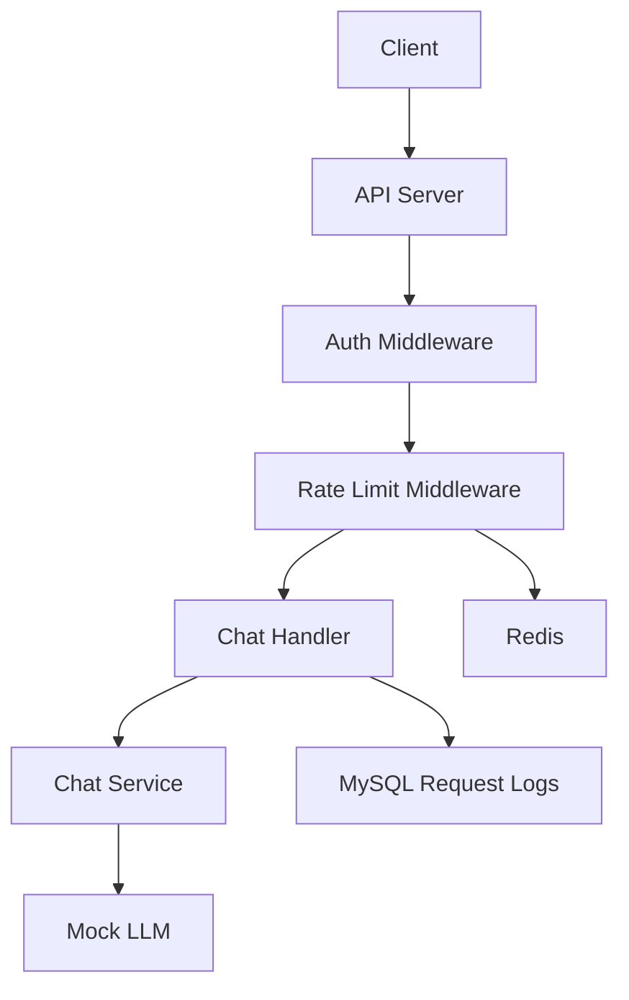

<div align="center">

# Mini AI Compute Platform

[](https://go.dev/)
[](https://gin-gonic.com/)
[](https://www.mysql.com/)
[](https://redis.io/)
[](https://www.docker.com/)

**一个面向 LLM 推理服务的轻量级 AI Compute Platform。**

模拟 AI Platform 的推理请求入口，支持 HTTP API、API Key 鉴权、Redis 限流、MySQL 调用日志和 Docker Compose 本地开发环境。

</div>

---

## 技术栈

* Go
* Gin
* MySQL
* Redis
* Docker Compose

---

## 功能列表

* 健康检查接口
* Chat Mock 推理接口
* 统一响应格式
* API Key 鉴权
* Redis 固定窗口限流
* MySQL 请求日志记录
* 查询最近请求记录
* Docker Compose 启动 MySQL / Redis

---

## 项目架构



> Redis 用于 API Key 维度限流

## 目录结构

```plaintext
.
├── Dockerfile
├── README.md
├── cmd
│   └── server
│       └── main.go
├── config.example.yaml
├── docker-compose.yml
├── docs
│   ├── api.md
│   └── architecture.md
├── go.mod
├── go.sum
├── internal
│   ├── api
│   │   ├── handler.go
│   │   └── response.go
│   ├── config
│   │   └── config.go
│   ├── middleware
│   │   ├── auth.go
│   │   ├── logger.go
│   │   └── rate_limit.go
│   ├── model
│   │   └── chat.go
│   ├── repository
│   │   ├── mysql.go
│   │   ├── redis.go
│   │   └── request_log_repository.go
│   └── service
│       └── chat_service.go
└── scripts
    ├── check.sh
    └── mysql
        └── init.sql
```

## 本地启动

### 1. 准备配置文件

```bash
cp config.example.yaml config.yaml
```

默认 API Key：

```plaintext
test-api-key
```

### 2. 启动 MySQL 和 Redis

```bash
docker compose up -d mysql redis
```

如果当前用户没有 Docker 权限，可以临时使用：

```bash
sudo docker compose up -d mysql redis
```

### 3. 启动 Go 服务

```bash
go run ./cmd/server
```

服务默认监听：

```plaintext
http://localhost:8080
```

## 接口测试

### 健康检查

```bash
curl http://localhost:8080/health
```

### Chat 接口

```bash
curl -X POST http://localhost:8080/v1/chat \
  -H "Content-Type: application/json" \
  -H "Authorization: Bearer test-api-key" \
  -d '{"model":"mock-llm","prompt":"hello"}'
```

### 查询最近请求记录

```bash
curl http://localhost:8080/v1/requests \
  -H "Authorization: Bearer test-api-key"
```
### 限流测试

```bash
for i in $(seq 1 25); do

  curl -s -o /dev/null -w "%{http_code}\n" -X POST http://localhost:8080/v1/chat \
    -H "Content-Type: application/json" \
    -H "Authorization: Bearer test-api-key" \
    -d "{\"model\":\"mock-llm\",\"prompt\":\"hello $i\"}"

done
```

超过限制后返回：

```json
{
  "code": 429,
  "message": "rate limit exceeded",
  "data": null
}
```
## 数据库表

请求日志写入 MySQL `request_logs` 表。

查看最近记录：

```bash
docker exec -it mini-ai-mysql mysql -uroot -ppassword ai_compute \

  -e "SELECT id, api_key, model, prompt, status, created_at FROM request_logs ORDER BY id DESC LIMIT 5;"
```

## API 文档

详见：

```plaintext
docs/api.md
```

## 后续计划

- [ ] SSE 流式响应

- [ ] 多模型路由

- [ ] Token 成本统计

- [ ] Prometheus 指标

- [ ] Grafana 监控面板

- [ ] 压测与性能优化

- [ ] 更完善的用户与 API Key 管理
